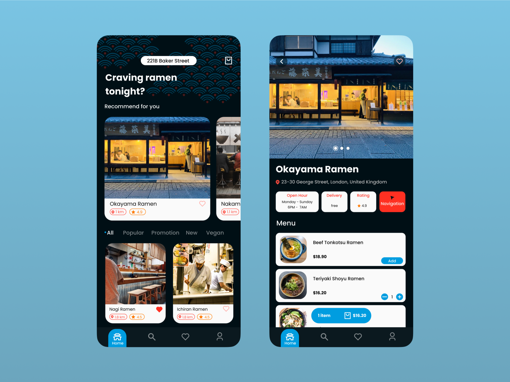

## A Resturant-finder app
 Restaurant App designed to provide users looking for nearby restaurants, view ratings, exploring menus, making reservations, or ordering takeout, our app has you covered.
Powered by Firebase,
Google Maps,
and other packages.

### Features:
- **Flutter UI**: A map view with google_maps_flutter where the user can choose to search for a restaurant. 
- **Geolocator & Geocoding API**: Integration of the geolocator package to access the user location's coordinates. 
- **Places API**: Connection with the Places API to retrieve location data and as well, autocomplete suggestions. 

## State Management:  Bloc 

## App Screenshots: 

### How to Use:
1. Clone this repository to your local machine.
2. Ensure you have Flutter installed and set up on your development environment.
3. Run `flutter pub get` to install dependencies.
4. Navigate to the `api` directory and run `dart pub get` to install the dependencies for the backend server. 
5. Set-up your API key in the project
6. Run the app using `flutter run` and explore the maps.

